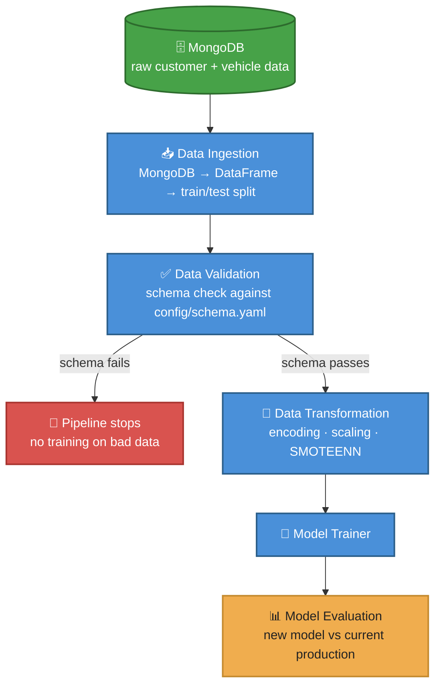
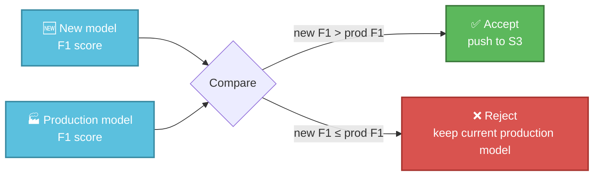
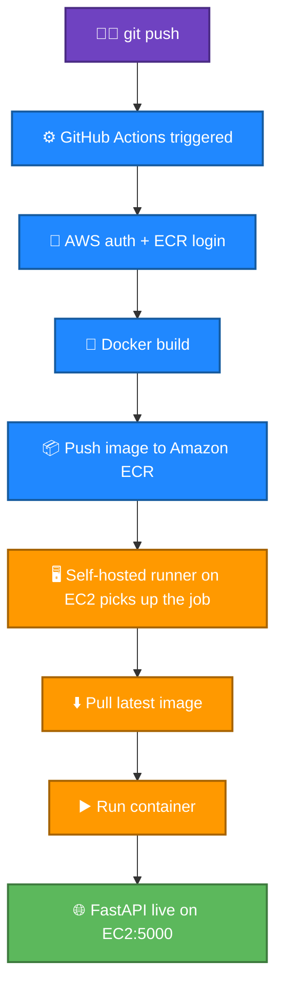
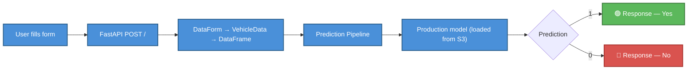

<div align="center">

# 🚗 Vehicle Insurance Prediction — End-to-End MLOps Pipeline

An ML system built to predict whether a customer will respond to a vehicle insurance offer — but the model is really the smallest part of this repo. The bigger story is everything wrapped around it: validation gates, a promotion rule that refuses to ship a worse model, and a CI/CD path that takes code from a laptop to a live EC2 endpoint without anyone touching the server by hand.


</div>

---

## What this actually predicts

Given customer and vehicle details — age, gender, driving license status, region code, whether they're already insured, vehicle age, past damage, annual premium, sales channel, and vintage — the model outputs:

| Response | Meaning |
|---|---|
| 🟢 `1` | Customer is likely to respond to the offer |
| 🔴 `0` | Customer is unlikely to respond |

It's a binary classification problem on the surface. Underneath, the goal was to build something that behaves like production software: a pipeline that catches bad data before it reaches a model, refuses to promote a model that's worse than what's already live, and deploys itself when the checks pass.

---

## The data pipeline, in detail

Data doesn't go straight from MongoDB into a model — it passes through four stages, each with a single job and each producing an artifact the next stage can trust.



**Ingestion** pulls whatever is currently sitting in MongoDB, not a CSV someone forgot to update six months ago. That single choice is what makes retraining on fresh data possible without editing code.

**Validation** runs before anything touches the model. It checks the incoming data against `config/schema.yaml` — right columns, right types, nothing missing, nothing extra. If it fails, the pipeline stops there. No model gets trained on a dataset that doesn't match what the rest of the system expects.

**Transformation** does the actual feature engineering: `Gender` becomes 0/1, categorical columns like `Vehicle_Age` get one-hot encoded, and numerical features go through a `ColumnTransformer` mixing `StandardScaler` and `MinMaxScaler` depending on the feature. The fitted preprocessing object gets saved as an artifact and reused at inference time, so a prediction request six months from now goes through the exact same transformation logic that training used.

One detail that matters more than it looks: one-hot encoding can produce different columns in train and test if a category shows up in one split but not the other. This pipeline explicitly reindexes the test set against the training columns and fills anything missing with zero —

```python
input_feature_test_df = input_feature_test_df.reindex(
    columns=input_feature_train_df.columns,
    fill_value=0
)
```

— which is a small line that quietly prevents a shape-mismatch crash in production.

**Class imbalance** gets handled with SMOTEENN — SMOTE oversamples the minority class, ENN cleans up ambiguous points near the decision boundary — applied only to the training set. The test set stays untouched so evaluation numbers still reflect the real distribution, not an artificially balanced one.

---

## The part that makes this an MLOps project, not a notebook

Most of the engineering effort went into one rule: **a newly trained model doesn't automatically replace the one in production.**



Say production is running at F1 = 0.82 and a retraining run comes back at 0.77. Without this gate, that worse model would just overwrite the good one the moment training finished. With it, the comparison catches the regression and production stays exactly where it was. It's a small check, but it's the difference between "we retrained" and "we retrained safely."

A few other things reinforce that same idea across the stack:

- **Model storage lives outside the app.** The production model sits in S3, not baked into the EC2 instance or the Git repo, so updating the model doesn't mean redeploying the server.
- **Every stage produces a typed artifact** — `DataIngestionArtifact`, `DataTransformationArtifact`, `ModelTrainerArtifact`, `ModelEvaluationArtifact` — passed explicitly to the next component instead of loose variables floating around the codebase. If a stage fails, it's obvious which one and why.
- **Errors carry context.** A custom `MyException` class wraps failures with the file and line they came from, so a crash three layers deep in an S3 call still tells you where it started instead of surfacing a bare boto3 traceback.
- **Structured logging** runs through every stage — ingestion, validation, transformation, training, evaluation, upload — so a failed run can be traced after the fact instead of guessed at.
- **No secrets in the repo.** AWS keys and the MongoDB URI live in environment variables and GitHub Secrets, injected at deploy time.

None of these individually are complicated. Together, they're the difference between a script that trains a model and a system you'd trust to retrain itself unattended.

---

## From commit to live prediction



The self-hosted runner is the piece that ties this together — it runs directly on the EC2 box, so GitHub Actions can pull the new image and restart the container without anyone SSHing in manually. Push to main, and within a few minutes the change is live at `http://<EC2-PUBLIC-IP>:5000`.

Inside the container, the app listens on port 5001; Docker maps that to 5000 on the host:

```bash
docker run -d -p 5000:5001 --env-file .env --name vehicleapp vehicle-insurance-app
```

---

## Inference path



Training and inference are kept apart on purpose. `GET /train` kicks off the full pipeline; `POST /` only ever touches the already-validated production model. They don't share code paths, which means a slow retraining run never blocks or interferes with a live prediction request.

---

## Project structure

```
YT-Mlops-proj1/
├── .github/workflows/aws.yaml      # CI/CD pipeline definition
├── app.py                          # FastAPI entrypoint
├── demo.py                         # Local training trigger
├── Dockerfile
├── config/schema.yaml              # Data validation schema
├── templates/vehicledata.html
├── static/css/style.css
└── src/
    ├── components/                 # ingestion, validation, transformation, trainer, evaluation, pusher
    ├── configuration/               # AWS + MongoDB connections
    ├── data_access/
    ├── entity/                     # config_entity.py, artifact_entity.py
    ├── cloud_storage/aws_storage.py
    ├── pipeline/                   # training_pipeline.py, prediction_pipeline.py
    ├── constants/
    ├── utils/
    ├── logger/
    └── exception/
```

---

## Tech stack

| Layer | Tools |
|---|---|
| ML | Python, Pandas, NumPy, scikit-learn, imbalanced-learn (SMOTEENN) |
| Data | MongoDB |
| Backend | FastAPI, Uvicorn, Jinja2 |
| Cloud | AWS S3, Amazon ECR, EC2, IAM |
| DevOps | Docker, GitHub Actions, self-hosted runner |

---

## Running it locally

```bash
git clone <repository-url>
cd YT-Mlops-proj1

python -m venv .venv
source .venv/bin/activate      # Windows: .venv\Scripts\activate

pip install -r requirements.txt
```

Create a `.env` file — never commit it:

```
MONGODB_URL=<your-mongodb-connection-string>
AWS_ACCESS_KEY_ID=<your-access-key>
AWS_SECRET_ACCESS_KEY=<your-secret-key>
AWS_DEFAULT_REGION=us-east-1
```

Then:

```bash
python demo.py     # runs the training pipeline
python app.py       # starts FastAPI at http://localhost:5001
```

Or with Docker:

```bash
docker build -t vehicle-insurance-app .
docker run -d -p 5000:5001 --env-file .env --name vehicleapp vehicle-insurance-app
# → http://localhost:5000
```

---

## Where this could go next

The evaluation gate and artifact-based structure already cover the basics of model governance, but a few things would push this closer to a real production platform: an MLflow-backed registry instead of a flat S3 path, automated data-drift and latency monitoring once it's actually serving traffic, unit and integration tests running in CI before the Docker build even starts, and eventually a canary or blue/green rollout instead of a straight container replacement on deploy.
